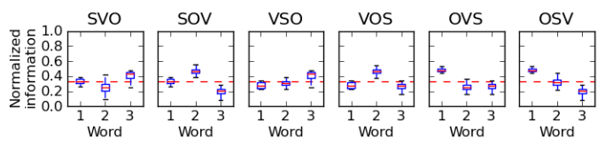

# Why the way things are

## Alt title: Why things in Arraland really aren't *that* weird

```text
If APL is a diamond, Arra is it crushed up and put in a saw blade.
```

> "All these other languages seem to solve a part of my problem, but none of them are designed together or built for performance..."

## Incidentally, Arra is Eclectic

Honestly, if I had to list all of the influences of Arra's, there'd be many. Up front, I will say that this language is strongly inspired by KDB/Q & APL, Haskell & Ur/Web, Julia & Fortress, Mercury & Datalog, Koka & Dex, and last but not least, Shen & Mathematica. This idea of eclecticism will be discussed shortly. Mind you, reader: Eclecticism is not to be taken as simply a virtue or as any kind of guiding design principle for your own Arra expressions. It is simply an explanation for it's own design. That explanation being that functional programming has gone mainstream, and through a renewed vigour: Old ideas start to converge again.

## Intentionally, Arra is a *maximalist* programming language

Consider these four rooms, taken from [this article](https://renoguide.com.au/interior-design/maximalism-vs-minimalism-beauty-in-extremes):


You have two pairs of similarly dimensioned and purposed spaces. All of them guest spaces. Extending from this, I think of programming languages as a bit of a living room for the mind. [Paul Graham](http://www.paulgraham.com/langdes.html) would like to analogize them to chairs, but I think living rooms are a much better analogy.

Ideally, I do not want a cluttered expressive space. Accordingly, none of these pictured rooms could be considered that. Actually, what I believe most people sense to be "complexity" in a language, it is akin to "clutter" in a room design. You can have complex spaces which do not feel cluttered, and you can have simple spaces that do.

What makes a room feel cluttered is a losing of a sense of purpose for the items in the room. If every item in the room serves it's purpose, and there is nothing added to the room, then minimalism and maximalism intersect. Where they diverge is in the contrasting or aligning of the objects in the room.

In a minimalist room, and a minimalist programming language, all objects have a uniformness to them, pushing the design through the entire space.

In a maximalist room, and a maximalist programming language, all objects have an elaborateness to them, pushing the design through the entire space.

So you could that Vector Oriented Programming is like the green couch or the fireplace in each of the maximalist rooms. The things the entire room are oriented around, yet are totally distinct from the rest of the room, all while parts of the room echo it's own design sentiment.

Instead of forcing everything *into* Vector Oriented Programming. It's taken as the main design cue, and everything else added to the language purposefully echoes that orientation, just in different aspects.

Arra when taken together, it is a rather complex language. Just as, or more complex than the languages it descends from. Just like in most languages there will be more than one way to solve a problem, however unlike most languages, [this complexity in design in *intentional*](https://www.infoq.com/presentations/Simple-Made-Easy/). While most other languages accrue complexity to address the tension between backwards compatibility and deficiencies in the language: The goal behind Arra is to provide a solid foundation to push back the inevitable need to address Arra's own deficiencies. With the hope that when those deficiencies do need to be addressed, they can be slotted in neatly among the other language constructs.

## The importance of notion and notation

Why am I going through so much pain to write such a long paper? Mostly about something that nearly all Lisp programmers will think is a triviality, already solved.

I'm speaking about syntax.

[APLers will understand the importance of syntax](https://www.jsoftware.com/papers/tot.htm), abstraction is less important, mainly because the syntax affords so much, you can go far without it.

In this paper I'll be speaking not just about syntax, but also how my language relates to other languages, while admiring and (constructively) criticizing essentially all of them. *This is me giving you: Every last room in the house, to have my language equally criticized.*

### Lisp programmers have no clue

Why is syntax so important and why are Lispers so keen to argue that it doesn't matter?

The same reason why every ancient programming language thinks that it has found and exploited the *one true abstraction*: Formulas for Fortran, the English language for Cobol, S-exprs for Lisp, arrays for APL, classes for Simula, line numbers for Basic, stacks for Forth, pointers for C, relations for Prolog, type theory for ML, the list goes on.

Ok, jokes aside. There's a real point, actually two.

The first: S-exprs are an amazing syntax for computers to do automatic translations of trees. __It's not a great surface language__, and there is no irony in using Chez Scheme, in the implementation of Arra, after all Chez and the Nanopass Framework is an excellent language for tree rewriting. [Although I'm sure Aaron Hsu would disagree.](https://www.youtube.com/watch?v=hzPd3umu78g) Point being: There is no amount of reasonable macro trickery that will make the ideas in APL expressible clearly in s-expr notation, it's just hard, it's just the wrong idea. The best we reasonably have is [April](https://github.com/phantomics/april), with some really smart people behind it. Even then, it's given up on the idea of trying to mix APL and Lisp with macros, and just *embeds APL as a domain specific language* in Common Lisp.

Second: As mentioned earlier, Arra is eclectic. So the notion of a *totalizing abstraction* is alien to Arra's design philosophy. Of course, aside from it's own totalizing abstractions. Instead *Domain Specific Abstractions* are emphasized to the programmer.

__Arra's goal:__ *To integrate as many rank polymorphic abstractions in a generalized and extensible runtime.*

In particular, generalizing rank polymorphic thinking to new types, and allowing the user to extend the language with their own types and rank polymorphic operators.

APL is, at it's core, a very simple and beautiful domain specific language, "generalized" by years of weary interaction with the world. It's execution mechanism is very simple as well. However, it hides many details from the programmer because of it's own totalizing abstractions. When looked at closely, APL's central execution method is seemingly identical to multiple dispatch on types, coupled with what I might call "iteration overloading". I believe this to be true and I'd be fascinated to see a counter-example.

Given all of the above is true, or at least mostly true. Then this gives us a new framework to:

* Think about how to give *some* static types to APL programs.
* Gives the programmer more, not less, interactive access to the abilities of the operators they have at their disposal
* Extends APL in a principled manner.

Three birds with one stone!

Put in different terms:

* Taking seriously that APL is a domain specific language for array manipulation, in a family of rank polymorphic languages.
* Rank polymorphism is common, it's just almost always expressed in very explicit terms, namely loops, maps, folds, etc.
* Many, if not all, cases of rank polymorphism can be understood as special cases of multiple dispatch.
* Multiple dispatch as an execution mechanism is well understood outside of APL circles, by extension making APL less weird and totalizing.
* Expressions can (and necessarily should) be expressed in a syntax that suits strengths weaknesses of the domain.
* The importance of notation, as pioneered by Dr. Iverson are ideas just as important, if not more important today.
* Arra's goal is to both: To retain the notion of the importance of notation, and at the same time retain the semantics afforded by Dr. Iverson's mathematical notation.
* And my goal with Arra, abet entirely contingent on it's predecessors. Is to expose what I consider to be all the best examples of orthogonal (domain specific) language constructs, tied together in a single coherent language.

In itself, making Arra yet another totalizing abstraction, yet one suited entirely to my own needs! And for the sake of the reader, a note on orthogonality: There are many language constructs in Arra, it makes no pretense of being a *simple* language. Some constructs in the language that will have semantical overlap, however they extend into the space of expressions in significantly non-overlapping ways. Some of these matters will be discussed further in this paper.

## Word order in programming languages

Commonly, programming languages are discussed as having a subject and an object. This is a cultural inheritance from Object Oriented Programming, and I am not here to try to completely reshape how these things are discussed. For better or for worse: Subjects and objects in programming languages, and [the philosophical implications](https://en.wikipedia.org/wiki/Subject-oriented_programming) have been deeply explored. Aside from Subject Oriented Programming *proper*, there are many other different analyses of subjects and objects in programming languages.

To outline the thrust of my work here: I'll illustrate what I consider to be the correct approach to analyzing "the subject" in programming languages, will modify this analysis slightly to match the mainstream analysis, and then the rest of this paper will use this modified analysis, with all it's implications and especially, vagaries.

Before I illustrate the correct analysis of subjects and objects in programming languages: I would like to express my debt of gratitude to `dukereg` at The APL Farm, for clarifying and correcting my approach. This section exists because of his *careful analysis* and his *patience* in relaying it's contents to me. With that said, thank you.

## *The Subject* in Programming Languages

The only relevant analysis of *the subject* in programming languages is the computer itself. The computer *does* things with the expressions we hand it, the expression being composed entirely of objects, that *it* as the subject, manipulates.

All other analysis of attempting to apply some kind of objective criteria that one particular object over another has the property of being *the* subject will fall prey to [Rice's Theorem](https://en.wikipedia.org/wiki/Rice%27s_theorem), I'd like to see a counter-example.

There really is no further analysis that does not fall prey to any form of vagaries. Instead I'll rely on intuition and commonly held understandings to buttress my argument.

## Modification on the Analysis of *The Subject*

So, it is the case that any expression we type into a computer has an *implicit* `SV` in front of it, which reads: *"The computer calculates..."*.

Otherwise, regardless of the word order, all of the rest of the words used in an expression can be roughly categorized as being either objects, verbs, and adverbs. Some languages go further, and form some forms of explicit support for [conjunctions](https://code.jsoftware.com/wiki/Vocabulary/PartsOfSpeech), [gerunds](https://code.jsoftware.com/wiki/Vocabulary/grave), and other forms of natural language. However these explicit extensions, and even these rough concept mappings themselves are *just metaphors*.

To illustrate how quickly this metaphor breaks down: *"Code is data and data is code."*

So: a verb is a noun, and a noun is a verb.

Clearly the metaphors to natural language have no use? Yet they seems so intuitive! This is exactly the reason why I prefer to preserve this analysis, rather than dispense with it entirely.

So to try to salvage these intuitions: It seems like when most people speak about *"the subject"* in an program expression. I and they, usually mean: *"The core, or most relevant structure, which forms the expression"*.

Again: I will not try to define the intuition further, lest I fall prey to Dr. Rice and his theorem.

Furthering this intuition, consider you have some "subject" `x`, in an express. The implicit `SV` and this `x`, to form a compound subject: *"The computer calculates ... with x ..."*.

## Why SVO word order (aka: left to right eval)?

### Popularity

This one is probably an easy sell for most programmers but seems a little out of place in APL-land. Dr. Iverson, in all of his brilliance: Set forth to create a unified syntax for mathematics. In his lifetime he came as close as humanly possible for such a thing, limited only by the tools and perspectives of his time. One large perspectival difference between mathematics and mainstream programming still with us today, having only exacerbated with time, is word order difference.

Take for example:

```rust
h(z, g(y, f(x))) // Math, and functional programmers

x.f().g(y).h(z) // Most programmers
```

Both equivalent, yet the second one's reading order follows the order of execution.

Now with the proliferation of the `|>` in many languages, first introduced by F# and made popular with Elixir. (Historically, Haskell had `&` before F#, same operator different syntax.) LTR ordering in functional programming languages is seen as the norm, where RTL ordering used to predominate. This changed took some time initially, as enough social capital to consider this alternative to be culturally viable was accrued. As soon as that happened, the changed happened very rapidly. To me this indicates that this is the preferable way to think about composition, and that the mathematical tradition likely has it just a bit backwards.

### Modern linguistic theories, and more arguments from popularity

I have much simpler ambitions than Dr. Iverson. I simply aspire to make Arra suitable as a programming language for exploratory data analysis, suitable for my own needs. In addition, I have to consider the insights brought to light by Dr. Iverson, and I'd like to take some time here to consider those intently. In particular about word ordering.

Starting out, let's make a table of the word orders and languages in them:

| Word order | Languages                                            |
| ---------- | ---------------------------------------------------- |
| SVO        | OOP langs. Functional langs after `\|>`. Arra.       |
| SOV        | Forth, also `SV`: `3 dup`                            |
| VSO        | Prolog. FP langs, also `VS`, and `AVS`: `(map f xs)` |
| VOS        |
| OVS        | APL                                                  |
| OSV        |

One interesting thing to note The 6 language groups are ordered by dominance, with `SVO` and `SOV` accounting for [85% of languages, as of 2013](https://wals.info/chapter/81).

### APL is a unique language

Now before the APL people get mad, the Forth people are surprised to get high praise. The reason to put Forth as a `SOV` language and not an `OSV` language, and APL as an `OVS` language instead of a `SVO` language: Has to do with how code in these languages is written *in the wild*.

In this table above table consider "the subject" to be "the core structure", and "the object" to be "that the verb uses to modify the subject".

So, yes an APLer might say this is a legal expression in `SVO` order:

```kdb
1 2 3 + 1
```

Seemingly the subject of the sentence is the array: "The array 1 2 3 has + 1 applied to it."

This is true, and shows the flexibility of the APL family of programming languages, and the weakness of using the subject of an expression to refer to anything other than the computer.

However, similarly, natural languages have flexible ordering in their grammar. `OVS` order in English is legal, consider: *"The program written by Kenneth."*

The point is to illustrate that APL, and most APL dialects use `OVS` ordering in any significant program, and that `SVO` ordering is really a nice trick of the grammar and a form of "passive voice" in APL. I'll be using the term "passive voice" in the rest of the paper, simply to mean "switching an `S` with an `O`", with no further analogies to linguistics.

Going further, instead in the wild, you really have APL code such as:

```kdb
1 + 1 2 3
```

You apply further transformations to the subject by adding more `OV` expressions to it's left. I hope that most APLers will recognize this analysis to be true, and not in the slightest bit unfair to APL. In fact it is actually highlighting how unique APL is as a programming language, or as a grammar, natural or synthetic.

### Industrial Forth and it's Implications

Otherwise, this shows that Forth has a more common grammar than initially thought, similar to French and Chinese. I would consider this fact a partial explanation for it's relative popularity. I'm sure this analysis of Forth's grammar has been done somewhere, I don't have a reference. But if you the reader, do know of one, I'll gladly add it to this paper. I'll justify this fact with an example and hope that the reader finds it obvious:

```forth
x 3 >   ( `SOV` common case in the wild )
3 x >   ( `OSV` yoda forth, valid but uncommon )
```

### Why is APL less popular?

As I hinted above, I think that APL's lack popularity, along many other factors, has to do with it's dominant word ordering. 1% of people in the world speak an `OVS` language natively, I would suspect that is close to the number of people who would consider themselves to be proficient at mathematics.

What I mean is that a select number of people are willing to put themselves through the rigor of learning a new language, mathematics: Which is dominantly `OVS`.

### More on the RTL vs LTR discussion, again

Of course left-to-right vs right-to-left execution has been a contentious topic in APL circles, the alternatives known since the initial descriptions of the grammar. In Dr. Iverson's time, there was much more motivation to follow the `OVS` ordering of mathematics.

However the world has greatly changed since these decisions were made, and the world has moved on. The relative amount of programmers and mathematicians entirely inverted during Dr. Iverson's life, after these decisions were made.

So I would argue that today, and *especially* with the popularity of `|>`, that `SVO` ordering should be embraced in a modern APL-like.

## Why right to left binding?

To most APLers, their instant reaction to LTR ordering is the expectation that variable binding will also be LTR. It may be a surprise to the reader that Arra subverts this expectation, and the next logical question is, why?

To explain this, there are really two levels of justification: One purely on an aesthetical level, and another on a little more technical level.

To highlight the aesthetical angle, operands being bound to the left is something that is expected of nearly every single language, even languages that are famous for their LTR execution (Forth and others), *bind their variables using RTL syntax*. The reason why this is done is so that you can line up variable names in a column on the left. Simple as that.

```kdb
//Fantastic RTL binds
a:1
b:2
c:a+b

//Terrible LTR binds
1:a
2:b
a+b:c
```

So aside from the aesthetical argument, I think there is a slightly deeper reason why this ordering is so important, and that can be drawn from lambda calculus. Loosely put: A let binding is just syntax sugar for a lambda abstraction. In essence, these are equivalent:

```ocaml
let x = 1 in x + 2
------------------
(\x -> x + 2) 1
```

Going further: Given that you have a distinct syntax for lambda abstractions from other primitives, binding should have a distinct syntax from other operators.

The justification for why binding *should* be distinct? Well.. Aesthetics.

If you really, really want to go down that chain of reasoning, and ponder past aesthetics, then let's consider the contrapositive: What if lambda abstractions did not have a distinct syntax from the other primitives. How strange and lacking of utility, a language would that be?

## RTL & LTR again, this time with types

A similar (breaking of) symmetry appears between the expressions that denote the application of *types*, and the application of *instances* of those types.

Stated explicitly: Application of types to types is LTR, however application of constructors to values is RTL.

So the natural question: Why?

### Aesthetics, again

Clearly aesthetics plays a role here, if you consider the LTR application of a constructor to a value, it would appear as: `v Con`.

Which is completely at odds to how construction commonly occurs in other languages, where application is solely expressed in an RTL manner. Namely: `Con v`. Arguably, this is the right choice.

Furthermore, data definitions and pattern matching look atrocious when instance application is LTR. This is left as an exercise to the reader. In contrast, consider the system that Arra uses: The syntactical symmetries in it's pattern matching, and the structural properties discussed below.

So, since I have used aesthetics as a guide to deeper reasons in this paper, I am unsatisfied to leave the reader with merely that justification. Writing the above sentences, I carefully considered my use of the word "construction" above. I could have worded it in other ways, such as "constructor application". However I think that specific wording, although initially mildly awkward, illustrates my point.

### Construction

*Construction* ("constructor application"), is the *binding* of a value, inside the constructor's resultant value.

I considered binding just earlier in this paper, and I provided multiple justifications, first guided by aesthetics, and later uncovering symmetries and reasoning though those symmetries. I'd like to think that the aesthetics or lack thereof, of an expression or it's mirrored form: Are revealing the structure of these symmetries.

It may seem that disregard for these structural symmetries, for the pursuit of mere syntactic symmetries, results in a derangement of design: Expressed in a lacking of desirable form.

### Application

The reader may want to consider that: *The application of a function to a value may result in that value being bound inside another value, constructed by that function.* This is useful to consider, especially in illustrating the reasoning behind the decision:

```kdb
1 {X x}  // X 1
```

As the reader scans the above expression from left to right: I suppose it is important I should justify why I consider construction to be distinct from general application, although it is normally represented as application in most languages.

Construction, in my eye, is similar to binding. As I've made my argument in these sections. However loose of a similarity this may be: I think it might be useful, just *one more time* in the context of the above expression apply the same contrapositive reasoning to the design choices made.

### Ordering

So operationally, it is possible to consider both cases where `X` is initialized in the runtime before `1` and vice versa. "If all the pointers line up" after construction, the two possible orderings construct identical objects ignoring their actual addresses.

What is important about the ordering: Is the *words*. What is contained in what?

### Symmetry

Similar to bindings, when you say `x:1`, you are not saying that `x` is in `1`, you are very much saying the opposite.

It would seem that if we are taking seriously the idea that "binding a value to a name" should go RTL, in contrast to "doing something with that value" going LTR. It seems this analogy hold to types and their instances, as well.

So: Construction, like binding, goes RTL. Application of types, like application of values, goes LTR.

## Why SAOV and not SAVO?

`SAVO` seems like the obvious extension to `SVO`, the ordering is the same, only requires the insertion of an adverb between the subject and verb.

After all, `OVAS` is the obvious extension to `OVS`, and this is the pattern taken in essentially every APL-like I have seen. I think this is the correct choice in this context.

### `|>`, *again...*

I would argue this is exactly the *wrong* default for a left-to-right language, let's consider `|>` yet again, some psuedocode in an ML-like:

```ocaml
[1;2;3;4;5;6;7;8]
  |> List.fold
    (fun acc x ->
      (* Lots *)
        (* Of *)
          (* Code *)
            (* In *)
          (* This *)
        (* Anonymous *)
      (* Function *))
    (initState initArgs)
```

My argument is that even though I highly praise `|>`, there are some syntactical issues. For one `|>` actually gives us `OAVS` order, which *is* significantly better than `AVSO` order. This lets us emulate `SAVO` order using the passive voice of `OAVS`.

So far, so good.

However, there is an issue, and that has to do with the final noun.

### Why `|>` is wrong

For one, aesthetically, it's just hanging out there by it's own.

Secondly, more technically, it's actually evaluated *before* what's to it's left, breaking left to right execution.

Aside from the arguments about operational semantics, on an intuitive level: I'm sure some of the readers here that have written in these languages where `|>` has become popularized and thought to themselves "I wish I could put that `initState` right under that `fold`, it would look so much nicer, would make a lot of sense". There may be some OOP programmers that have looked at code similar to the above, and wondered this exact same thing.

This strange ordering around the trailing noun is exactly a consequence of `|>` being thrown into a language that is primarily `VSO` ordered, trying to ham-fist `SVO` into it, and the sharp edges stick out as soon as you introduce adverbs. It's as simple as that.

### Passively Voiced Adverbs

So yes, `SAOV` naively seems to bring some inconsistency to the language grammar. But to further cement the idea that this is intuitive, let us consider English once more and this sentence: *"Algebraically Rodger slept."* The reader should note that this is an `ASV`, which is essentially `AOV` in the passive voice.

### One last argument for `SAOV`, this time with technics

From the information in [this paper](https://proceedings.neurips.cc/paper/2010/file/0c74b7f78409a4022a2c4c5a5ca3ee19-Paper.pdf), there is a very interesting and relevant diagram, displayed here:



I'd like the reader to notice that the `O` of a word triple across all natural languages always bears the most informational density. After some thought, this obviously makes sense:

```text
Arthur eats salad.
Arthur eats arsenic.
```

The object of the sentence is doing the work here. It doesn't matter if it's Arthur, or Ken, or Roger who eats the arsenic. The fact that it's a poison and not food that's the important detail. Same for the verb, it doesn't really matter if Arthur sees the object in question or inhales it, the object of note is still the most important factor in the sentence.

__As a quick aside__, I have the intuition that in programming, since as a sentence part "objects" have high informational density: Are commonly used in passive form expressions, can be (ad)verbs (first class functions), and their ordering is inconsistent relative to other programming languages. My though is which of these 3 variables, or some other variable not considered here: Which is the "first order cause of the 'difficulty of comprehension' of an arbitrary expression in a language where those variables are held constant"? This is something that would have to be explored further, elsewhere. I think this would be very enlightening research to the Human-Computer Interaction field.

In the context of the high information content beared in the objects of expressions, the value of using `SAOV` over `SAVO` comes from the intentional manipulation of the informational gradients of the expressions written by the programmer as they are on the screen. I described this intuitively earlier, when moving `initState` around was discussed. However my goal is to now give a technical explanation of the intuition, couched in the research detailed above.

The reason that putting the `O` ahead of the `V` is valuable, aside from aesthetics and operational semantics: Is that typically in most expressions written, they have this character that the verb typically dominates the expression when counting AST nodes. So this the part of speech that is either last or tied for last for informational density in natural languages, is interestingly the part that takes up the most "screen real estate".

Before the following, I would like to point out that I hope it is obvious to the reader that adverbs have more information density than verbs, and less or equal density than subjects. In programming, expressions with higher order functions have higher informational density than the same expression written in the "direct style" with no adverbs, just verbs, conditionals, and recursion. Further, from English:

```text
Arthur excitedly        eats arsenic.
Arthur excitedly    discards arsenic.
Arthur remorsefully     eats arsenic.
Arthur remorsefully discards arsenic.
```

As you can see with these 4 sentences, seemingly *how* Arthur does what he's doing is more important than *what* he actually does with the arsenic. This *how* is essential to the context of what Arthur is doing. You really can't understand his intentions of *what* he did, without understanding *how* he did it. The point is to illustrate what was written above: That adverbs have more informational density than verbs, and equal or slightly less density than the subject. Following this, all the rest follows naturally.

So when reading across the expression, left to right, for `SAVO` languages you have, in order: A sequence of medium, medium, low, and high density (Pictorially: `--_^`). In essence all of the medium to high density relations are interrupted by a segment of low density. Worse yet, in more complicated expressions such as `SAVOVO`, it seems like the first `O` is more closely bound to the second `V` and second `O`, it reads like `SAV(OVO)`, instead of the proper parsing of `(SAVO)VO`. Even worse yet, this has a very jagged density gradient: `--_^_^`

`SAOV` on the other hand has a smoother density gradient: `--^_`. It's extension, while abet initially strange looking, has obvious binding strength of the sub expressions, and has a smoother information gradient: `SAOVVO` ::: `(SAOV)VO` ::: `--^__^`.

With all of this background built up, I'll finally demonstrate a proof for the main thesis: `SAOV` ordering is optimal over `SAVO`.

The metric to consider is `i`, which I will define as: `The sum of the absolute slope of the density sequence of an expression.`

`Optimality`, in this context: Is equivalent to the ```minimization of `i` for languages fixed by word ordering and sentence structure```.

To get an intuition for the proof, I'll table some example sentences, their information density gradient, absolute slope sequence, and their sum:

| Sentence      | Density Gradient | Absolute Slopes | Sum |
| ------------- | ---------------- | --------------- | --- |
| `OAVS`        | `^-_-`           | 111             | 3   |
| `OVOAVOVOAVO` | `^_^-_^_^-_^`    | 2211222112      | 16  |
| `OAOVVOAOVVO` | `^-^__^-^__^`    | 1120211202      | 12  |
| `OVAVOVOAVS`  | `^_-_^_^-_-`     | 211222111       | 13  |
| `SAOVVOAVVO`  | `--^__^-__^`     | 012021102       | 9   |

By induction, there are two cases to consider. The lack and presence of adverbs:

* Lacking adverbs: `SAOV` and `SAVO` are *identically optimal*.
  * This is trivial to show: consider `SVOVOVO` vs `SVOVOVO`.
* Considering adverbs: `SAOV` is optimal.
  * This is also trivial to show, consider: `SAOVVOAOVVO` vs `SAVOVOAVOVO`.

### And, Bob's your uncle!

So this single change in word order matches our intuitions about *how programs should be structured, ideally* and has a firm foundation in information theory applied to natural languages. In reality: I think that this resolves to merely a reflection of the information density presenting itself to us on screen. With us sensing the fact that there is congruence or incongruence in the expressions, intuitively.

### Arthur excitedly arsenic eats?

Clearly, this is now where the analogy with English breaks down, however I must stress `OV` forms are very common in `SOV` languages, the second group, accounting for about 35% of the total language spoken. As such, it is not uncommon to see `OV` and `AOV` constructions *in English*, just in the passive voice: `Arthur eats.` and `Algebraically, Roger slept.`

More thoroughly: The "act of expression" is the process of taking the non-linear and non-propositional concepts in your mind, and turning them into a linear sequence of propositions, either spoken or written.

Remember the focus is the optimality of reading an expression *on screen*, and not optimizing for how it would be *spoken*. However, it is quite simple to express the sentence in English, translating it rather than transliterating it. In addition to using visual aids like gesturing or highlighting on the screen, while explaining a particular adverb-containing expression to a newcomer. As such, I believe there should be no difficulty in expressing the meaning of any expression structured in such a syntax.

Going further, again, the focus in on screen readability. The reason why it is so important should be obvious at this point. But in my closing expressions, I'll make the point explicit, in analogous form: When reading an expression on screen, it's natural to want to have all of the "related, important bits" of your code all in one place, close to each other. In essence, this is extending the intuition about good software architecture to the entire grammar of a language. Clustering all of the highest information density parts of your expressions together, multiplied across the entire source.

### Why optimize for *that* specific condition?

Well, simply because the conditions that lead to optimized natural languages used a different optimality criteria. To apply the process of optimization to programming languages seems to beg for a different criteria.

Consider the how you would define the "natural-world" `i` metric discussed in the original paper? It would be akin to: `The average of the averages of the n-window scan of the absolute slopes of the density sequence of an expression.`

This is to implied from optimizing for as few high density clusters as possible, and sharp density gradient slopes at a maximum number of points. To distribute high information density words as much as possible in between low density words, giving a sentence that is on average: uniform in it's information sequencing.

The reader may notice this is essentially *exactly* the inverse definition of the `i` used in the proof above. This is completely intentional and key to this proof.

This definition of this natural-world `i` metric is already more complex than the definition of `i` used in the proof above. The vagueness around the definition of `n-window` begs for further definition: Is that `n` an arbitrary `n`? Maybe the trivial `n = 2` is enough? How about `n = 3`, as it matches the triplet structure in the analysis? Is it ranged over: `[2..n] where n = len expr - 1`? All these questions would have to be answered for a complete definition. Of which, it is not relevant to give for the proof above.

The dual nature of these `i`s suggest their own naturality and aptness for their role.

### Confidence or hubris?

I'd like to earnestly title this paper *"The next 700 APLs"*, since I'm very convinced that APL-as-a-family is the right language design. It's at the end of the previous 700, although ironically has been around since the beginning. Furthermore, that the specific `SAVO` word order I've outlined *is* the correct word order for an APL. This is also exactly the argument that I would present for LTR word ordering to Dr. Iverson today, if he was still with us. Alas he passed away a few years before I ever learned of J. Rest in Peace, Dr. Iverson & Mr. Hui.

## Why Multiple dispatch?

The reason this was chosen over the alternatives is, as I'm sure many APLers know, that it's very common that these types of "statically typed APL" languages tend to have *type definitions that are longer than their function implementations*. This is completely unacceptable to any APLer. However academically minded language designers come again and again to *"statically typed APL mountain"* and try to ascend it's heights, only to fall onto the spikes of verbosity. My long standing desire has been to ascend this mountain, keen of the locations where others have fallen. Only time will tell if my travels will lead to success.

## Why overloading *and* traits *and* macros *and...*

As mentioned before, Arra is not a simple language. However, one of the largest single considerations in it's design is enabling more notational thinking. The issue is that operators are just one form of notation, although this language's focus *is* operators in the APL style.

### Macros are special, just like traits and overloading

There are clearly forms of notation which require contexts spanning multiple symbols. This is most clearly seen in the notation used for lambda abstractions used in APL/J/K. So Arra does not shy from the notion that, just like user defined operations, programmers will desire the ability to design their own notation to overload these contexts spanning multiple operators. As such, a macro system is required.

### Traits are special, like macros and overloading

Furthermore, why traits are included in the language: To afford the programmer the ability to not just overload operators, but also *interfaces*. This is a subtle distinction, but has fraught the Julia community, in a bit of a subtler way.

## Why the strange macro system?

As I mentioned in the previous section, the rationale is to overload notational contexts: As is the theme with this document, this section is meant to make sure this stone is left well turned.

What I mean by that statement is that merely overloading operators, iterators, interfaces is really not enough structure to allow for the overloading of lexically scoped contexts.

I haven't defined this term, nor do I think it's important. I'll merely claim it, and demonstrate it's use in existing macro systems and hopefully the meaning will be obvious to the reader.

First, for simplicity: Let's consider lisp macros, and then macros generally in other languages, and finally macros in Shen and their implementation in Arra.

### Bold Claims about Lisp

In lisp, how I conceptualize macros, is that they allow you to overload how parentheses work. This is of course: Ignoring reader macros, which overloads how the reader translates the raw text into S-exprs.

So I'm claiming a lisp macro just lets you control how `(...)` works, and overload it's meaning by allowing you to change the pattern of symbols found inside of it.

The most obvious case being a simple rewriting macro, called explicitly by name: `(my-macro arg1 arg2)`.

This is used to great extent, in particular in the `if` macro: Where the second and third arguments are rewritten in a form which is conditionally evaluated on the first argument. This changes normal order of execution of functions: Where all arguments are evaluated before being passed to the function.

So: If "calling a function" in lisp is just "wrapping a subexpression in parentheses", and macros control the calling of functions, then macros are just controlling how "the wrapping of parentheses on a subexpression" works. By extension: Macros overload contexts as delimited by parentheses.

### Macros in other languages

This is a huge topic, but none the less, I'm going to tackle the core of it. By this force, I'll have to have left out much about this topic, and could easily write a similarly sized document on just this single topic alone.

The __key point__ to macros in essentially every language is: That a macro allows you to pattern match on a single token acting as the macro head or a complex of tokens acting as an instance of a macro, then taking an instance of this pattern as an argument, allowing you to algorithmically manipulate this argument into a new form, which is then passed back to the language.

### Why Shen does this better than (almost) everyone else

I think I will struggle to explain as succinctly, so I suggest that the reader study the [Shen Macro System](https://shenlanguage.org/OSM/Macros.html). Aditya has done some excellent evangelism for Shen, available [here](https://www.youtube.com/watch?v=lMcRBdSdO_U) and [here](https://www.youtube.com/watch?v=BUJNyHAeAc8).

What is most important is the simplicity and power of Shen's macro system. It stands in a very strong local optima between a proper macro system and a fully fledged pattern language. Speaking of pattern languages:

### Mathematica does macros better than Shen, but

It is extraordinarily complex. This is not a bad thing for Mathematica, it's pattern language is necessarily complex, since it operates as the core to the rest of the language.

Mathematica is a pattern language for symbolic computation, on the other hand Arra is a data analysis language, with an emphasis on pattern matching.

Moreover, Arra's focus on symbolic computing is mostly for it's amenability to be used as a differentiable language. Rather than Arra being a language focused on symbolic computing itself.

Given these constraints, it is very likely that some patterns in Mathematica's pattern language will be adopted by Arra's pattern matching mechanisms. The focus will be on enabling Arra expressions to be succinctly expressed in the language of patterns, more than Arra being used as a pattern language.x

## Why the strange query language?

It is pretty well understood (in some circles) that although SQL is a popular language for expressing and querying the nature of relations, it is a rather poor language for this task. Gladly, some of the pains of using standard SQL have been eased though more standardization, notably Common Table Expressions (CTEs). Even with these newer semantic extensions to SQL, it still remains a syntactically poor language generally.

Before SQL was a twinkle of the eyes of Donald Chamberlin and Raymond Boyce, a superior theoretical foundation and implementation for the theory of relations, even better than the Relational Model of Edgar Codd. Was invented in France by Alain Colmerauer and Robert Kowalski, namely Prolog.

Much work has gone into refining the system designed by these two individuals, with what I would consider it's current apex being the Mercury Language.

For the longest time, I have worried that an effective modelling of relations in the prolog style, represented as sets of facts, could not be effectively decomposed into columns of sub-factual data. Now that Aaron Hsu has very [clearly demonstrated](https://www.youtube.com/watch?v=hzPd3umu78g) that arbitrary trees can be decomposed into a pair of vectors defining their parent and closest leftward sibling relations, allowing very efficient processing of tree structures using vector oriented techniques, I have some hope.

Having seen Aaron's work, I eventually came to believe that this technique could be applied to decomposing some of the graph structure of Datalog-style relations. Seemingly covering the relevant subset of the language relating to defining sets of facts and querying their relationships. Now the larger question is: Is it possible to implement an efficient runtime that merges these techniques?

One of the sub-goals of this language will be to test various implementations of this approach. There are much simpler approaches to similar problems that will certainly tried: For example it seems straightforward to use this approach to represent algebraic data types since, they always form a tree.

## Why is pattern matching / `if` prefix?

Again, aesthetics... But as the reader may have noticed I have not shied away from *seriously considering the alternative*.

As I'm sure the reader has come to expect, that isn't the single answer: The main rationale is that pattern matching is a separate sub-language.

Just like all the other keywords define *their own* sublanguages, pattern matching forms it's own sublanguage. The rest grammar of this language's grammar is actually flexible enough to allow for pattern matching to be implicitly implemented in terms of the other parts of the grammar, namely operators and application. However this would make parsing pattern matches rather complex, since the grammar of patterns is non-trivial.

Still, this doesn't explain why these keywords are applied in prefix form. To illustrate: All of the sublanguages in Arra use a keyword to delimit the context of the sublanguage, and that context is terminated by a matching semicolon. The `open`, `data`, and `macro` sublanguages, have their context introduced by their respective keyword and eliminated by the expected semicolon. This pattern of context delimitation by keyword and semicolon would be broken if `match` and `if` were applied to their argument postfix, and this is why they stand in their position.

Furthermore: The conditional clause of in both of these keywords is evaluated *before* the branch evaluation flows to. So considering just the operational semantics of these branching constructs, it makes sense to at least put the condition before the bodies, aside from the reasoning about the grammatical consistency across sublanguages.

## Why statically typed?

It's been said again and again that APL does not need a type system, and that the virtues of it's model of computation come from it's limited set of types.

I agree that both of these sentiments are correct, especially when APL is taken as a domain specific language for mathematics, that "grew up" to be a general purpose programming language.

However my goal with Arra is to design a general purpose language from the ground up, *with a strongly embedded domain specific language for linear algebra*. APL acts as that domain specific language. Yet that heart which give it life, is not Arra's sole objective. It's objective is to cleanly bring together many disparate expression sublanguages, efficiently and effectively, in a single lingua-franca.

To obtain this goal, the ability to give name to and specify new types is required. So APL's virtues of simplicity of type becomes a vice very quickly, since it would be possible to emulate much of what is possible with the current design in the limited language of types that APL provides. After all they are general enough for most of what we want.

However on the other hand, [this article](https://existentialtype.wordpress.com/2011/03/19/dynamic-languages-are-static-languages/) clearly explains the deficiencies in this approach. Mostly from a denotational standpoint.

Yet the impact on performance from non-specialized data structures applied to an inappropriate problem domain can still be very palpable. Thus it seems appropriate to extend APL to new data structures, like hashmaps and other structures that do not neatly fit in an n-dimensional array.

## Parallel and Distributed Computing

[More Harper](https://existentialtype.wordpress.com/2017/11/04/sequentiality-is-the-essence-of-parallelism/)!

### Content Addressable Code

Distribution in a distributed environment is arguable one of the most difficult challenges, aside from maybe protocols and the CAP theorem.

## An effect system?

In designing this language, I had the intuition that something like an effect system similar to Koka would be necessary for the ability to have content addressable code, and at the same time immensely useful for rewriting pure programs into the equivalent efficient mutable programs. What was brought to my attention over time was that the Dex language. The language arguably closest to mine in design, utilizes an Effect system for a number of optimizations in their runtime.

This section is dedicated to *thanking* the team behind Dex for showing me that my intuitions in part, are solidly founded. As well as, for breaking new ground in studying the interactions between effect systems and vector oriented languages.

## Fact columns as row types

In considering the structure of facts, it is rather clear that it is mostly straightforward to add an inferencing type system onto this structure. Mercury is an implementation of this idea, to great effect. In Mercury, a type is associated with each variable in a predicate. Following from that, for each disjoint set of predicates defined, for each mode: The sign (in/out) of each variable is then fixed. The *range* of that variable and the *covering* of that range by those predicates, is what defines that predicate's determinism mode. It's determinism mode, given by a fixed sign for each variable, defining it's ability to produce: Multiple solutions to a query, exactly one, or a number of other possibilities.

This very simple and elegant algorithm covers a wide range of the relevant expressional capabilities that Prolog more generally allows. Even with the limitations that Mercury sustains: Nearly any form of relational structure or query is translatable into this language, and is amenable to static verification.

A single fact is akin to a row in a table: A type for a variable in a fact is akin to the type for that column in that table. Taking this idea further, the definition of a table is a type, namely a product type, the obvious extension to product types is row types, and because of this reason, Arra has row types for fact tables.

### Still more room on the table

Even with these advanced techniques, constraint satisfaction, and more generally, SMT solving are likely to require some form for integration under the regime of holism. Z3 is the likely target, given it's maturity. Although this likely will come as a library, rather than as a language feature.

## Functions and Predicates

Many objects in arra can act as predicates. In the most simplest cases, literal booleans and any expression returning a boolean, can act as a predicate. Although these constructs are not *true* predicates: Given that a predicate can return arbitrary values as solutions, alongside signalling it's success or failure. None the less, this intentional blurring of this distinction is both pragmatic and safely expressible because of Arra's type system.

Although predicates are included along side functions and effort has been put in to reduce their distinction. The question remains: Can we do without them?

In a language that maximized simplicity above all else, it might be justified to exclude predicates, due to their semantic overlap with functions and their additional implementational and semantical complexity. Needless to say, this additional complexity poses no problems for Arra, and it's explicit inclusion in the semantics of the language is justified twofold:

__Firstly:__ Predicates are commonly used in mathematics. So commonly so, that one of the [mathematical devices](https://en.wikipedia.org/wiki/Iverson_bracket) that bear Dr. Iverson's name, has everything to do with predicates and their relationship to vectors. So forgoing their inclusion into the language would seem like a strange choice.

__Secondly:__ That the inclusion of a Datalog-style query system, makes it seems suitable that they would be supported first-class, alongside functions.

This all said: There are patterns which are difficult to express with predicates and some predicates are difficult to express with patterns. This to me acts as an indication that, even though these constructs contain some semantical overlap: Their boundaries extend orthogonally into the space of expressions.

## Why Sums and Unions?
